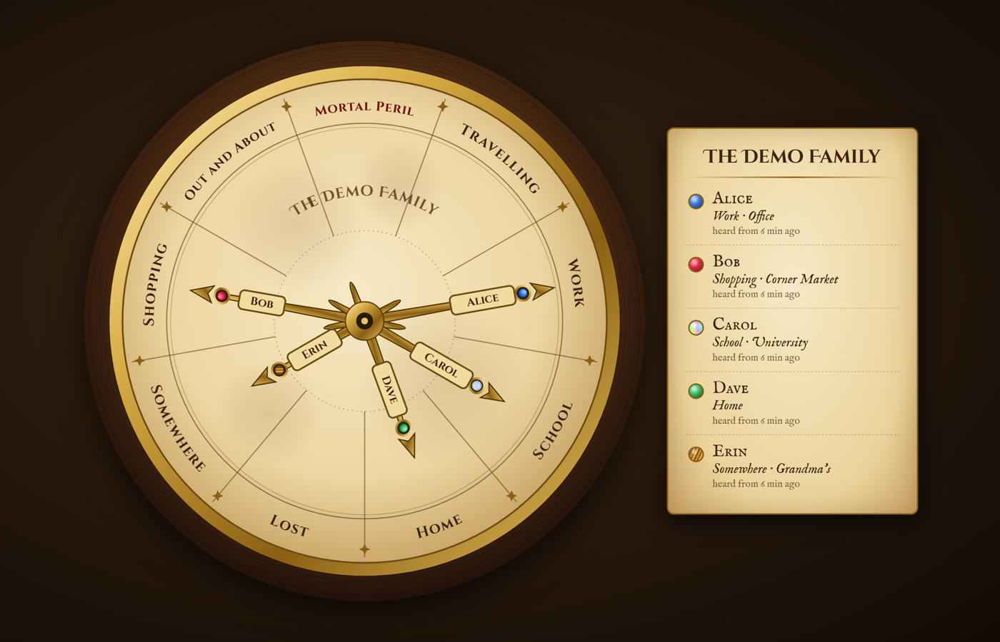

# Weasley Clock Card

A Home Assistant Lovelace card in the style of Mrs. Weasley's clock: one hand per person, pointing at where they are instead of what time it is.



*(Demo data. The people and places are made up.)*

## What it shows

Nine faces, with Mortal Peril at twelve like the book:

| Face | When |
|---|---|
| **Mortal Peril** | Away from home, phone battery under 10% and not charging |
| **Lost** | No location report for 4 hours while away, or 12 hours while at home |
| **Home** | In that person's home zone |
| **Work** / **School** | In one of that person's work or school zones, or stopped at a place on their own work list (see [Place lists](#place-lists)) |
| **Somewhere** | In any other named zone (a friend's house, grandma's, the gym), or stopped at a place on the shared Somewhere list |
| **Shopping** | Stopped at a store (see [Place lists](#place-lists)) |
| **Out and About** | Stopped anywhere else |
| **Travelling** | Away and moving |

They're checked in that order and the first match wins. The side panel shows each person's face, the place name and when their phone last reported. Tap a hand or a name to open that person's more-info.

Hands swing to a new face with a bit of overshoot, wobble while travelling, and tremble in Mortal Peril (the label pulses red). Everything honours "reduce motion".

## Requirements

- A `person` entity per family member, with at least one device tracker.
- Zones (Settings → Areas, labels & zones → Zones) for the places you want named.
- **For Out and About and Shopping**, the tracker has to report when someone has *stopped*. The card was built on [iCloud3](https://github.com/gcobb321/icloud3), which puts a person in a temporary stationary zone (`StatZon1`, `StatZon2`, ...) when they stop at an unnamed place. Without that, those two faces never get used and a stop shows as Travelling. If your tracker reports stops some other way, set `stopped_pattern`.
- Optional: a battery level sensor (and charging status sensor) per phone for Mortal Peril.

## Install

**HACS (custom repository):** HACS → ⋮ → Custom repositories → add this repo's URL as type *Dashboard* → install **Weasley Clock Card**.

**Manual:** copy `weasley-clock-card.js` to `/config/www/weasley/`, then add a resource (Settings → Dashboards → ⋮ → Resources) for `/local/weasley/weasley-clock-card.js?v=1` as a JavaScript module. Files in `/local` are cached for a month, so bump `?v=` whenever you update the file.

It looks best on its own dashboard in a **panel** view, especially on a wall tablet.

## Configuration

```yaml
type: custom:weasley-clock-card
title: The Smith Family
units: mi                 # or km, for "x mi from home"
shops_url: /local/weasley/shops.json?v=1
people:
  - name: Alice
    entity: person.alice
    gem: sapphire
    battery: sensor.alice_phone_battery
    battery_status: sensor.alice_phone_battery_state
    work_zones: [office]
  - name: Bob
    entity: person.bob
    gem: ruby
    home_zones: [bobs_apartment]   # someone who lives elsewhere
    school_zones: [university]
```

### Card options

| Option | Default | |
|---|---|---|
| `people` | required | List of people (below) |
| `title` | `Our Family` | Engraved on the dial and on the side panel |
| `units` | `mi` | `mi` or `km` |
| `lost_after_hours` | `4` | Away with no report this long → Lost |
| `lost_at_home_after_hours` | `12` | At home with no report this long → Lost (phones report less often at home, and some get switched off overnight) |
| `peril_battery` | `10` | Battery % below which an away phone means Mortal Peril |
| `stopped_pattern` | `^StatZon` | Regex on the person's state that means "stopped at an unnamed place" |
| `shops_url` | none | Shop list for the Shopping face |
| `somewhere_places_url` | none | Shared list of places (any person) that count as Somewhere, e.g. post offices |
| `place_radius_m` | `100` | How close a stop must be to a single-point place on a work list |
| `face_labels` | | Rename faces, e.g. `{out: "Gallivanting", somewhere: "Visiting"}`. Keys: `peril`, `travelling`, `work`, `school`, `home`, `lost`, `somewhere`, `shopping`, `out` |
| `links` | | Buttons in the top-left corner, e.g. `[{name: "← Home", path: /lovelace/0}]` |

### Per-person options

| Option | Default | |
|---|---|---|
| `name` | required | Shown on the hand and in the side panel |
| `entity` | required | The `person` entity |
| `gem` | by position | `sapphire`, `ruby`, `emerald`, `topaz`, `amethyst`, `pearl`, `opal`, `tigerseye` |
| `home_zones` | `[home]` | Zone ids (without `zone.`) that count as home |
| `work_zones` | `[]` | Zone ids for Work |
| `school_zones` | `[]` | Zone ids for School |
| `work_places_url` | | This person's own list of extra work sites (see [Place lists](#place-lists)) |
| `battery` | | Battery level sensor |
| `battery_status` | | Charging status sensor (anything containing "charg" but not "not" counts as charging) |

## Place lists

Find My (and most trackers) only give coordinates, not place names. Zones cover the places you name one by one; for everything else the card can read static lists, which are plain JSON files in `/config/www/`. They're only checked when someone is **stopped** at a place that isn't a zone, in this order:

1. that person's own **work list** (`work_places_url`) → Work
2. the shared **Somewhere list** (`somewhere_places_url`) → Somewhere
3. the **shop list** (`shops_url`) → Shopping
4. otherwise → Out and About

The face shows the place's name, e.g. "Work · Riverside Clinic". Nothing is looked up while the card runs.

**List format.** An array of places. `n` is the name shown, `la`/`lo` the coordinates. A place with a building outline (`b`: `[minLat, minLon, maxLat, maxLon]`) matches anywhere inside it plus 40 m; a single point matches within 60 m (shop and Somewhere lists) or `place_radius_m` (work lists, default 100 m, to cover a parking lot):

```json
[
  {"n": "Riverside Clinic", "la": 51.4980, "lo": -0.0870},
  {"n": "Central Library", "la": 51.5100, "lo": -0.1300, "b": [51.5097, -0.1305, 51.5103, -0.1295]}
]
```

**Work lists** are handy for people who move between many sites: a nurse, a contractor, someone who covers several offices. Build them however you like (by hand, from a spreadsheet, from a Google My Maps export). A hundred sites is a few kilobytes and doesn't clutter Home Assistant the way a hundred zones would.

### Shops and other place types from OpenStreetMap

`tools/build_shops.py` builds the shop list:

```
python tools/build_shops.py --area 51.5074,-0.1278,40 --area 52.2053,0.1218,20
```

Each `--area` is `LAT,LON,RADIUS_KM`. Copy the resulting `shops.json` to `/config/www/weasley/` and set `shops_url`. Only the one-off query goes to the Overpass API.

With `--tag` it builds a list of any other kind of place, for example a Somewhere list of post offices and libraries:

```
python tools/build_shops.py --area 51.5074,-0.1278,40 --tag amenity=post_office --tag amenity=library --out somewhere.json
```

Check the result by hand: OpenStreetMap tags some shipping stores and campus mailrooms as post offices. Edit `SHOP_TYPES` in the script to change what counts as shopping (by default: groceries, big box, hardware, pharmacy, clothes, malls and similar; gas stations, convenience stores, liquor, salons and car repair stay Out and About). Re-run it every few months as stores change, and remember to cover every area people shop in: a trip outside the circles shows as Out and About.

## Tips (mostly iCloud3)

- iCloud3's device import screen may only list your own devices at first. Family Sharing devices arrive a few seconds after login; add them through Configure → Add device.
- iCloud3 only reads zones when it starts. After adding a zone, reload the integration.
- Reloads and restarts cause a few seconds of `unknown`/`unavailable`. The card keeps each hand where it was.
- After arriving somewhere, expect Travelling for several minutes before the stop registers (iCloud3's stationary threshold plus its polling interval).
- If someone also runs the Companion app, set its location permission to **Always**. "While in use" barely reports.

## Demo

`demo/index.html` runs the card with fake data, no Home Assistant needed (the **Stops** button shows a work list, the Somewhere list and a shop at once). From the repo folder run `python -m http.server`, then open http://localhost:8000/demo/.

## Notes

- Fonts (Cinzel, IM Fell English) load from Google Fonts, so the tablet needs internet access. Without it the card falls back to Georgia.
- Plain JavaScript web component, no build step.
- Written with a lot of help from an LLM.
- Not affiliated with or endorsed by J.K. Rowling, Warner Bros. or anyone else connected to Harry Potter. It's a fan project.

## License

MIT
